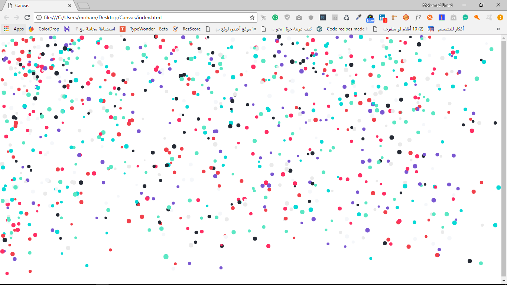

#The Canvas bubbles
this is the practice on canvas how to draw the canvas and resize it then how to draw elements and styling it then how to animate it and interact with each element in our canvas.

here is the .

### How I made it!?
I follow this [tutorial][https://www.youtube.com/watch?v=vxljFhP2krI&list=PLpPnRKq7eNW3We9VdCfx9fprhqXHwTPXL&index=4] to make this project.

### What i use!?
* JavaScript OOP.
    * ES6 class and new keywords
* HTML5 & JavaScript Canvas.